# 源码获取：https://mbd.pub/o/bread/YZWXl5puZQ==

🌐 一个基于 Spring Boot + Vue 3 的现代化社区养老服务平台，为老年人提供便捷的养老院查询、活动报名、健康管理等服务。


## ✨ 特性

- 🚀 **现代化技术栈**: Spring Boot 3 + Vue 3 + Element Plus + MyBatis Plus
- 📱 **响应式设计**: 完美适配PC、平板、手机等多种设备
- 🔒 **安全可靠**: JWT认证 + 权限控制 + 数据加密
- 📊 **数据可视化**: ECharts集成，数据统计一目了然
- 🐳 **容器化部署**: Docker支持，一键部署
- 📈 **高性能**: Redis缓存 + 数据库优化 + 异步处理

## 🏗️ 系统架构

### 技术栈

| 层级 | 技术选型 |
|------|----------|
| 前端 | Vue 3, TypeScript, Element Plus, Pinia, Axios, ECharts |
| 后端 | Spring Boot 3, MyBatis Plus, MySQL, Redis, JWT |
| 开发工具 | Vite, Maven, Node.js, IDEA, VS Code |
| 部署 | Docker, Nginx, Docker Compose |

### 架构图

```
┌─────────────────┐    ┌─────────────────┐    ┌─────────────────┐
│                 │    │                 │    │                 │
│   前端应用层     │◄──►│   网关层        │◄──►│   后端服务层     │
│   (Vue 3)       │    │   (Nginx)       │    │   (Spring Boot) │
│                 │    │                 │    │                 │
└─────────────────┘    └─────────────────┘    └─────────────────┘
                                                      │
                                                      ▼
                                            ┌─────────────────┐
                                            │                 │
                                            │   数据存储层     │
                                            │   (MySQL+Redis) │
                                            │                 │
                                            └─────────────────┘
```

## 📦 项目结构

```
community-elder-system/
├── elder-api/                 # Spring Boot后端项目
│   ├── src/
│   │   ├── main/java/        # Java源代码
│   │   │   ├── config/       # 配置类
│   │   │   ├── controller/   # 控制器层
│   │   │   ├── service/      # 服务层
│   │   │   ├── mapper/      # 数据访问层
│   │   │   ├── entity/      # 实体类
│   │   │   └── utils/       # 工具类
│   │   └── resources/       # 资源文件
│   └── pom.xml              # Maven配置
├── elder-front/              # Vue 3前端项目
│   ├── src/
│   │   ├── api/             # API接口
│   │   ├── components/      # 组件
│   │   ├── views/           # 页面视图
│   │   ├── stores/          # 状态管理
│   │   ├── router/          # 路由配置
│   │   └── assets/          # 静态资源
│   └── vite.config.ts       # Vite配置
├── mysql/                   # 数据库文件
│   └── db_elder.sql         # 数据库初始化脚本
└── screen/                  # 系统截图
    ├── front/              # 前端界面截图
    └── back/               # 后端界面截图
```

## 🚀 快速开始

### 环境要求

- JDK 17+
- Node.js 16+
- MySQL 8.0+
- Redis 6.0+
- Maven 3.6+

### 1. 克隆项目

```bash
git clone https://github.com/your-username/community-elder-system.git
cd community-elder-system
```

### 2. 数据库初始化

```bash
# 创建数据库
mysql -u root -p -e "CREATE DATABASE db_elder CHARACTER SET utf8mb4 COLLATE utf8mb4_unicode_ci;"

# 导入数据
mysql -u root -p db_elder < mysql/db_elder.sql
```

### 3. 后端启动

```bash
cd elder-api

# 配置数据库连接(修改 application.yml)
# spring.datasource.url: jdbc:mysql://localhost:3306/db_elder
# spring.datasource.username: root
# spring.datasource.password: your_password

# 启动服务
mvn spring-boot:run
```

### 4. 前端启动

```bash
cd elder-front

# 安装依赖
npm install

# 启动开发服务器
npm run dev
```

### 5. 访问系统

- 前端地址: http://localhost:5173
- 后端API: http://localhost:8080/api
- Swagger文档: http://localhost:8080/doc.html

## 📖 使用指南

### 普通用户功能

1. **注册登录**: 手机号/邮箱注册，JWT令牌认证
2. **养老院查询**: 按地区、价格、服务类型筛选
3. **活动报名**: 查看社区活动，在线报名参与
4. **个人中心**: 管理个人信息、报名记录、收藏

### 管理员功能

1. **用户管理**: 用户信息审核、权限分配
2. **养老院管理**: 养老院信息维护、审核上架
3. **活动管理**: 活动发布、报名统计、数据导出
4. **数据统计**: 用户行为分析、业务数据可视化

## 🔧 配置说明

### 后端配置 (application.yml)

```yaml
server:
  port: 8080
  servlet:
    context-path: /api

spring:
  datasource:
    url: jdbc:mysql://localhost:3306/db_elder
    username: root
    password: 123456
    driver-class-name: com.mysql.cj.jdbc.Driver

  redis:
    host: localhost
    port: 6379
    password: 
    database: 0

  servlet:
    multipart:
      max-file-size: 10MB
      max-request-size: 100MB

jwt:
  secret: your-jwt-secret-key
  expire: 86400000
```
## 📸 系统截图

以下是系统的主要界面截图，更多详细截图和功能演示请查看 [SCREENSHOTS.md](SCREENSHOTS.md)

### 前端界面

| 登录页面 | 养老院列表 | 活动详情 |
|----------|------------|----------|
| 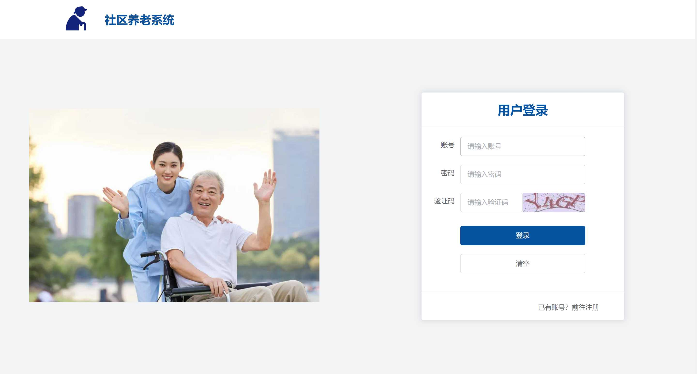 |  | 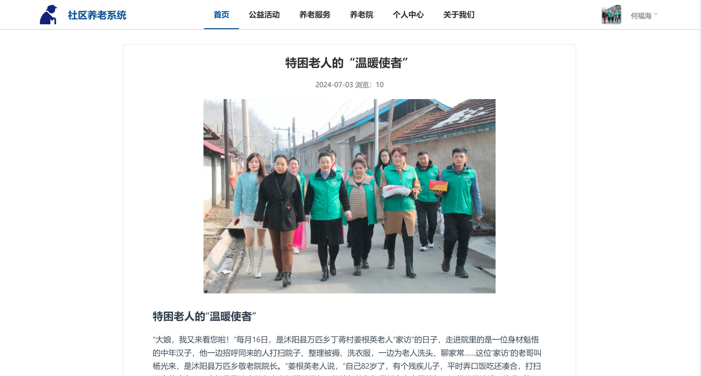 |

| 个人中心 | 数据统计 | 移动端适配 |
|----------|------------|------------|
| 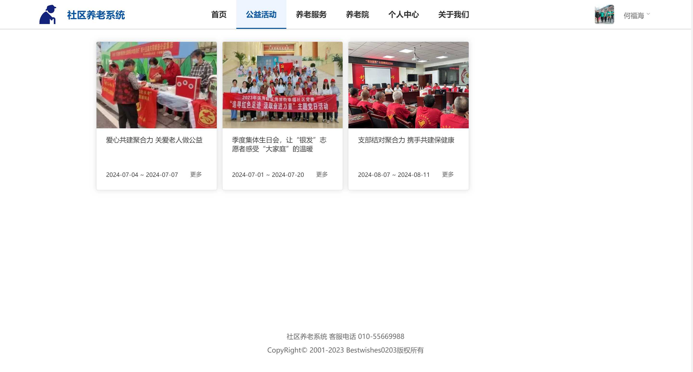 | 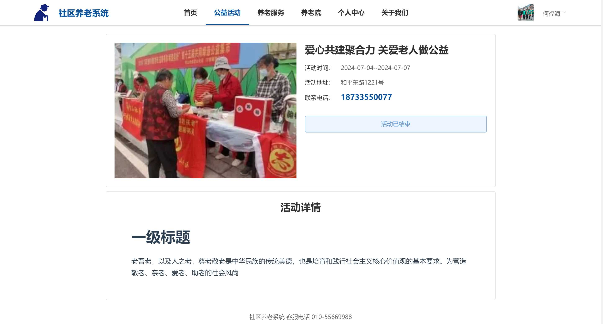 | 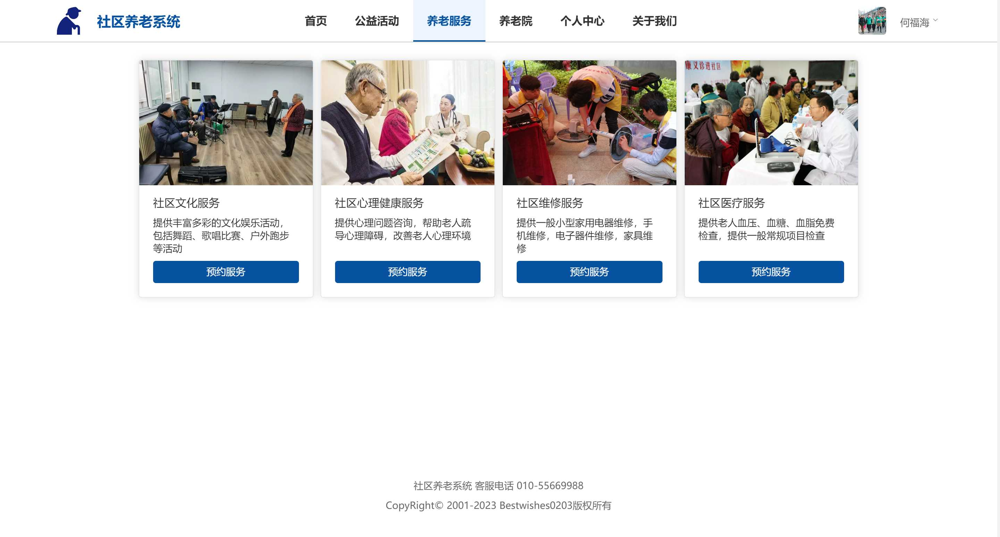 |

### 后端管理界面

| 用户管理 | 养老院管理 | 活动管理 |
|----------|------------|----------|
| 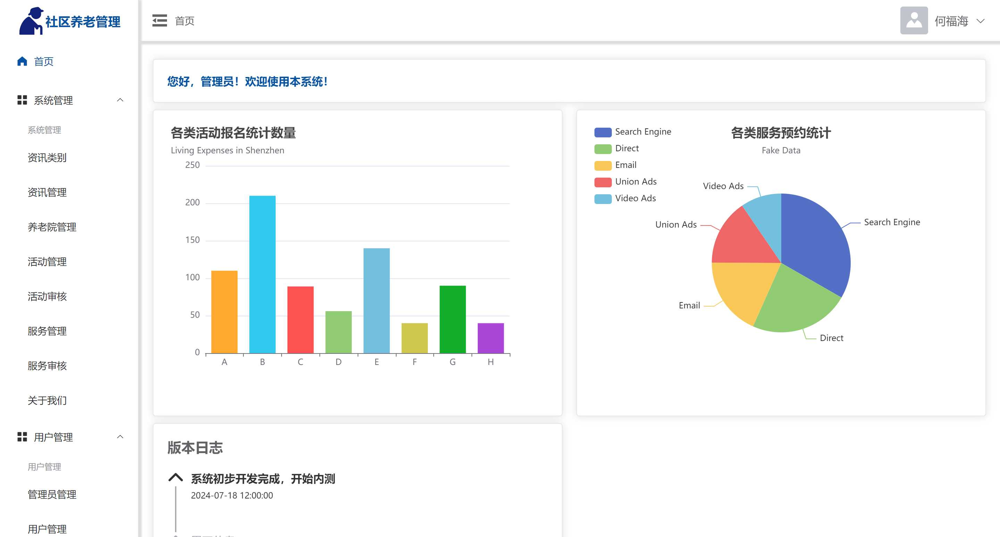 | 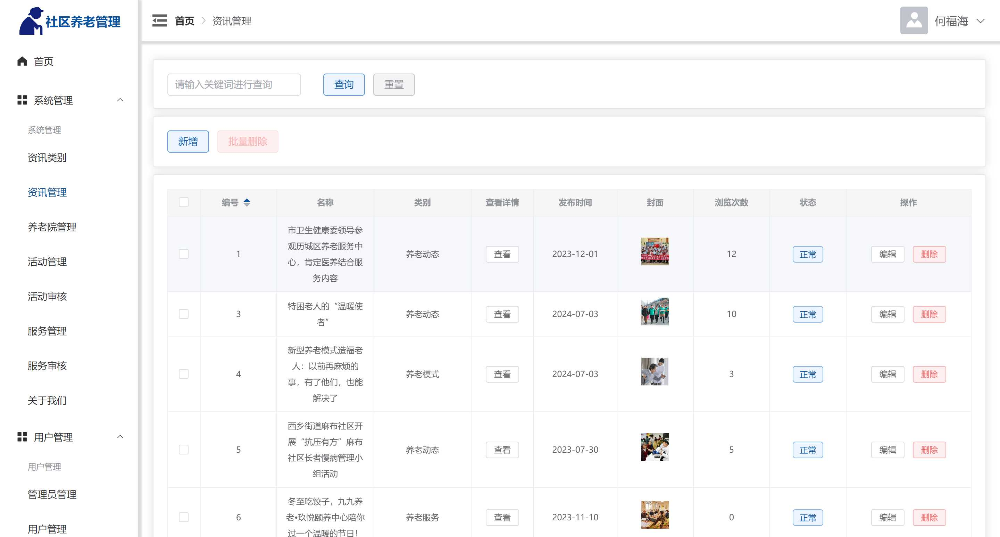 | 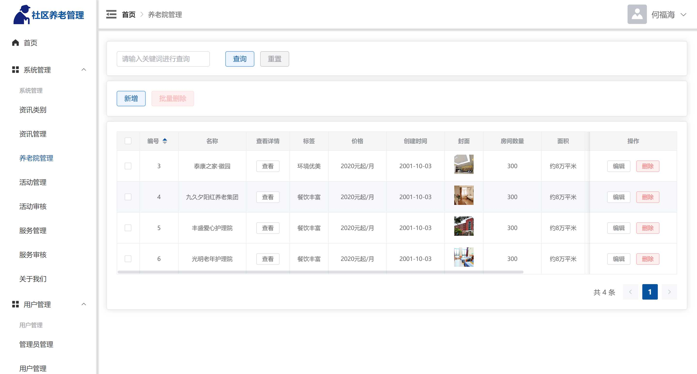 |

| 数据统计 | 系统设置 | API文档 |
|----------|------------|----------|
| 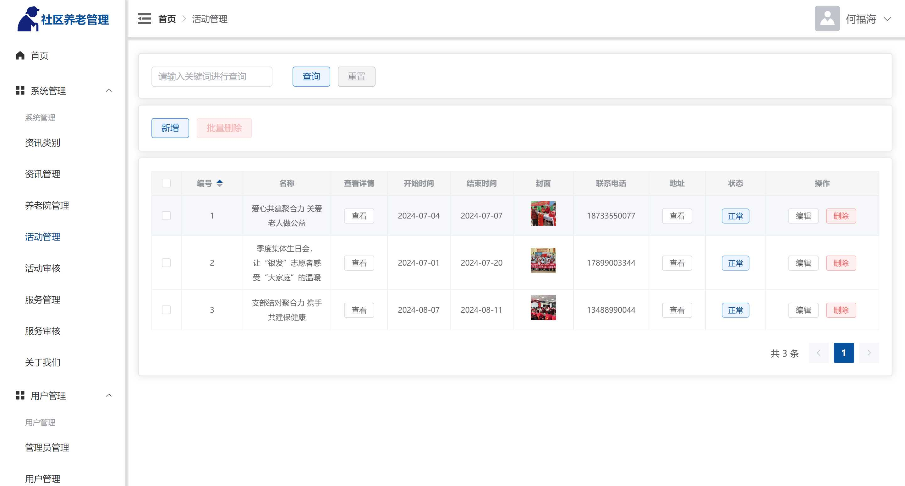 | 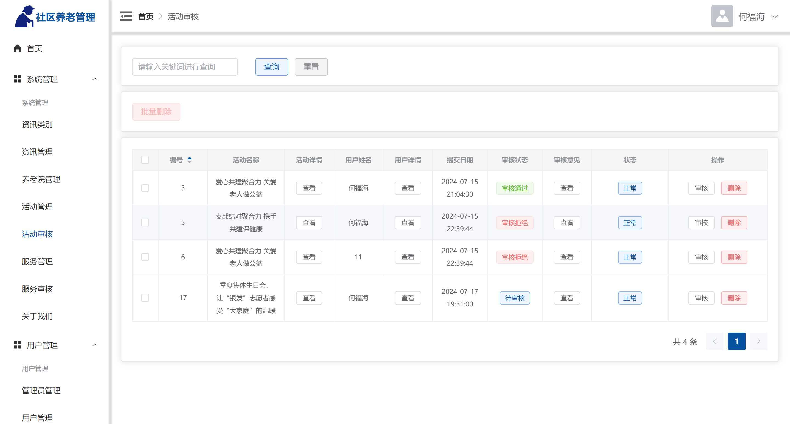 | 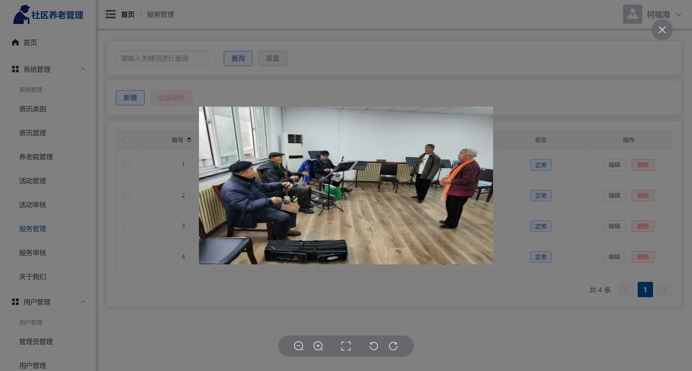 |


